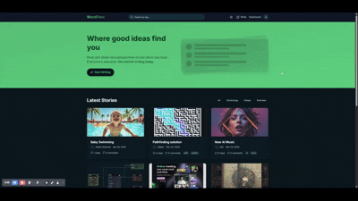

# WordFlow - Modern Blogging Platform 📝

[](https://nextjs.org/)
[](https://www.typescriptlang.org/)
[](https://tailwindcss.com/)
[](https://www.prisma.io/)
[](https://next-auth.js.org/)
[](https://opensource.org/licenses/MIT)

WordFlow is a modern, feature-rich blogging platform built with Next.js 14, offering a seamless writing and reading experience. With support for Markdown, real-time previews, and a beautiful dark mode interface, it's the perfect place for writers and readers to connect.



## ✨ Features

- 🎨 Modern, responsive UI with dark mode support
- 🔐 Secure authentication with NextAuth.js (Credentials & Google providers)
- 📝 Rich text editor with Markdown support
- 🏷️ Tag-based article organization
- 👥 User profiles and following system
- 💬 Interactive comment system
- 👏 Article reactions (claps)
- 📊 Reading statistics and analytics
- 🔍 Full-text search functionality
- 📱 Mobile-friendly design

## 🛠️ Tech Stack

- **Framework:** Next.js 14 (App Router)
- **Language:** TypeScript
- **Styling:** Tailwind CSS
- **Database:** Prisma with SQLite
- **Authentication:** NextAuth.js
- **State Management:** React Hooks
- **Icons:** React Icons
- **UI Components:** Custom components with Tailwind
- **Markdown:** React Markdown
- **Date Handling:** date-fns
- **Image Upload:** next-cloudinary
- **Animations:** Framer Motion

## 🚀 Getting Started

### Prerequisites

- Node.js 18+ 
- npm or yarn
- Git

### Installation

1. Clone the repository:
```bash
git clone https://github.com/yourusername/wordflow.git
cd wordflow
```

2. Install dependencies:
```bash
npm install
# or
yarn install
```

3. Set up environment variables:
```bash
cp .env.example .env
```

4. Configure your environment variables in `.env`:
```env
DATABASE_URL="file:./prisma/dev.db"
NEXTAUTH_URL="http://localhost:3000"
NEXTAUTH_SECRET="your-secret-key"
GOOGLE_CLIENT_ID="your-google-client-id"
GOOGLE_CLIENT_SECRET="your-google-client-secret"
CLOUDINARY_CLOUD_NAME="your-cloud-name"
CLOUDINARY_API_KEY="your-api-key"
CLOUDINARY_API_SECRET="your-api-secret"
```

5. Initialize the database:
```bash
npx prisma migrate dev
```

6. Start the development server:
```bash
npm run dev
# or
yarn dev
```

Visit `http://localhost:3000` to see your application running.

## 📁 Project Structure

```
wordflow/
├── app/                    # Next.js 14 app directory
│   ├── api/               # API routes
│   ├── auth/              # Authentication pages
│   ├── write/             # Article editor
│   └── [username]/        # User profiles
├── components/            # React components
├── lib/                   # Utility functions
├── prisma/               # Database schema
├── public/               # Static assets
└── types/                # TypeScript types
```

## 🔒 Authentication

WordFlow supports multiple authentication methods:
- Email/Password (Credentials)
- Google OAuth
- (More providers can be added easily)

## 💾 Database Schema

The application uses Prisma with SQLite (easily switchable to PostgreSQL or MySQL). Key models include:
- User
- Article
- Comment
- Tag
- Clap
- Bookmark
- ReadHistory

## 🎨 Styling

- Fully customizable with Tailwind CSS
- Dark mode support
- Responsive design
- Custom animations
- Typography optimized for reading

## 🔍 Search

- Full-text search for articles
- Tag-based filtering
- Author filtering
- Sort by popularity/date

## 📈 Analytics

- Reading time estimation
- View counts
- User engagement metrics
- Content performance tracking

## 🤝 Contributing

Contributions are welcome! Please feel free to submit a Pull Request.

1. Fork the repository
2. Create your feature branch (`git checkout -b feature/AmazingFeature`)
3. Commit your changes (`git commit -m 'Add some AmazingFeature'`)
4. Push to the branch (`git push origin feature/AmazingFeature`)
5. Open a Pull Request

## 📝 License

This project is licensed under the MIT License - see the [LICENSE](LICENSE) file for details.

## 🙏 Acknowledgments

- [Next.js](https://nextjs.org/)
- [Tailwind CSS](https://tailwindcss.com/)
- [Prisma](https://www.prisma.io/)
- [NextAuth.js](https://next-auth.js.org/)
- [React Icons](https://react-icons.github.io/react-icons/)
